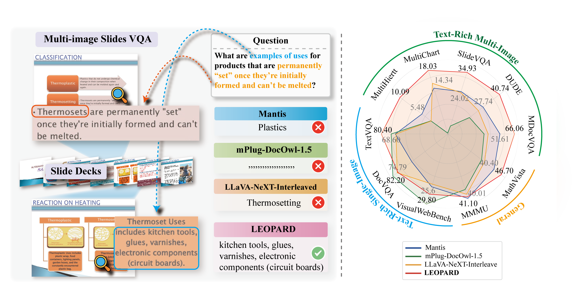

# LEOPARD : A Vision Language Model for Text-Rich Multi-Image Tasks

This is the repository for Leopard, a MLLM that is specifically designed to handle complex vision-language tasks involving multiple text-rich images. In real-world applications, such as presentation slides, scanned documents, and webpage snapshots, understanding the inter-relationships and logical flow across multiple images is crucial.

The code, data, and model checkpoints will be released in one month. Stay tuned!

  
  
  

  

### Updates

---
- [x] [2024-10-19]. Evaluation code for Leopard-LLaVA and Leopard-Idefics2 is available.
- [x] [2024-10-30]. We release the checkpoints of Leopard-LLaVA and Leopard-Idefics2. 

---

### Key Features:

---
- A High-quality Instruction-Tuning Data: LEOPARD leverages a curated dataset of approximately 1 million high-quality multimodal instruction-tuning samples specifically designed for tasks involving multiple text-rich images.
- Adaptive High-Resolution Multi-image Encoding: An innovative multi-image encoding module dynamically allocates visual sequence lengths based on the original aspect ratios and resolutions of input images, ensuring efficient handling of multiple high-resolution images.
- Superior Performance: LEOPARD demonstrates strong performance across text-rich, multi-image benchmarks and maintains competitive results in general-domain evaluations.

---

### Evaluation

---
For evaluation, please refer to the [Evaluation](evaluation/README.md) section. 

### Model Zoo

---
We provide the checkpoints of Leopard-LLaVA and Leopard-Idefics2 on Huggingface.

- [Leopard-LLaVA](https://huggingface.co/wyu1/Leopard-LLaVA)
- [Leopard-Idefics2](https://huggingface.co/wyu1/Leopard-Idefics2)

